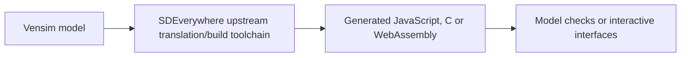

# About this fork | SDEverywhere

**Upstream project:** [Climate Interactive / SDEverywhere](https://github.com/climateinteractive/SDEverywhere). GitHub marks `Aryakia/SDEverywhere` as a **fork** of that repository. The existing README, package descriptions, diagrams, demos and source belong to the upstream project and contributors; their presence in this fork does not establish Arya Kia's authorship of those features.

## What can responsibly be shown on a personal portfolio

1. Link to the [original upstream project](https://github.com/climateinteractive/SDEverywhere) and preserve its existing licence and contributor attribution.
2. Document any *specific* personal contributions only after checking actual commits, branches, issues or upstream pull requests. No such individual contribution is claimed by this document.
3. If this fork is used for experiments, describe their purpose, reproduction steps and outcome in a separate branch or case study without presenting upstream features as original work.
4. If the repository is only a reference copy, make that fact clear in any portfolio summary; do not create a personal product homepage from upstream documentation.

## Technical context (upstream capability, not a claim of local work)

This is a high-level explanation based on the existing upstream README, not a diagram of custom modifications in the personal fork. No screenshots or upstream assets are newly copied in this PR.

## GitHub About fields

Preserve the fork's upstream-derived description and `http://sdeverywhere.org/` homepage unless verified local changes warrant a distinct description; the appropriate provenance is already represented by GitHub's fork relationship. Suggested topical tags, if needed: `system-dynamics`, `vensim`, `simulation`, `model-testing`. The connected GitHub actions available here do not edit About fields directly.

**Licence:** Keep the inherited MIT licence and existing attribution. No fork visibility, source files or build configuration are changed by this document.